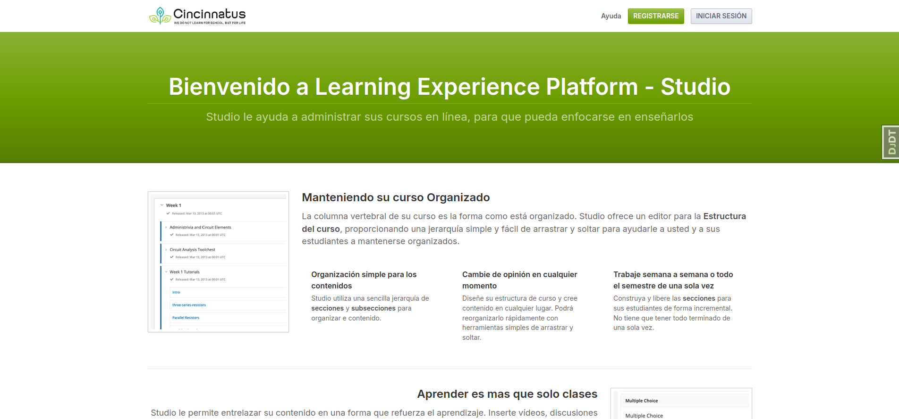

# How to Apply the Theme

Follow these steps to set up the theme for your OpenedX instance:

1. **Navigate to the Themes Directory**  
   Open your terminal and run the following command to go to the correct directory:
   ```bash
   cd $(tutor config printroot)/env/build/openedx/themes
   ```

2. **Clone the Theme Repository**  
   Clone the theme repository into the directory by running:
   ```bash
   git clone https://github.com/intellisysdcorp/intellisysdcorp-af-caerus-lxp-themecincinnatus.git lxp-theme
   ```

3. **Apply the Theme to Your OpenedX Instance**  
   Set the newly cloned theme to your OpenedX instance with this command:
   ```bash
   tutor local do settheme lxp-theme
   ```
# Preview

